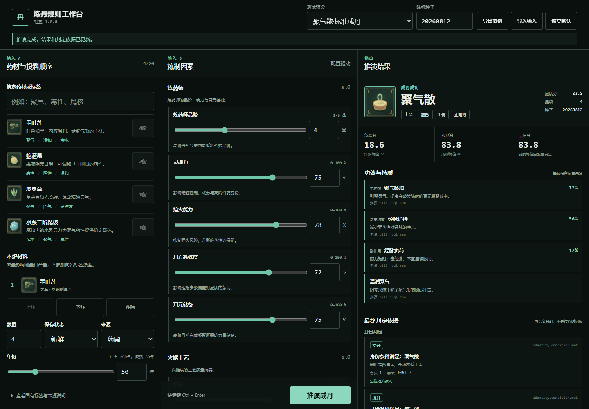

# 炼丹规则模拟器

一个面向策划与开发的网页端炼丹规则调试工具。选择药材、调整火候与工艺、丹炉、火种、环境和天时等因素后，点击一次“推演成丹”，即可查看最终丹药、品质、数量、功效、副作用、特质以及可追溯的判定原因。

本项目不模拟逐帧炼制过程。网页验证稳定后，规则配置和确定性测试向量将作为 Unity 正式实现的依据。



当前版本包含 18 种材料、8 种正式丹药、14 个确定性预设与 29 张原创 PNG 图标；成功、未成丹、残丹、废丹、受约束异丹和炸炉分支均可直接测试。

## 本地运行

```powershell
npm install
npm run dev
```

## 验证

首次运行真实浏览器验收前安装 Chromium：

```powershell
npx playwright install chromium
npm run check
```

`npm run check` 会依次执行 Vitest、生产构建和 Playwright 主流程测试。仅重建图标时运行 `npm run assets:generate`。

## 文档

从 [`docs/README.md`](docs/README.md) 开始阅读。产品边界、规则模型、配置规范、实施计划和验收标准均以该目录中的现行文档为准。
