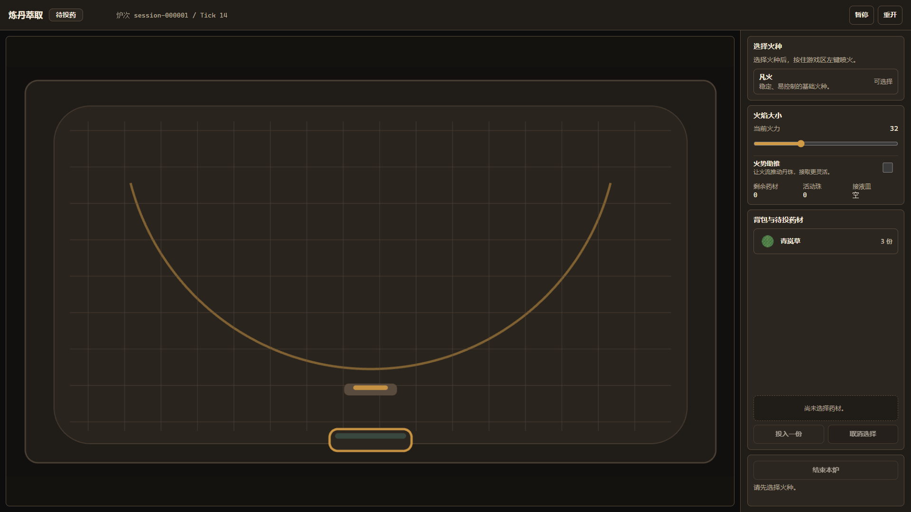
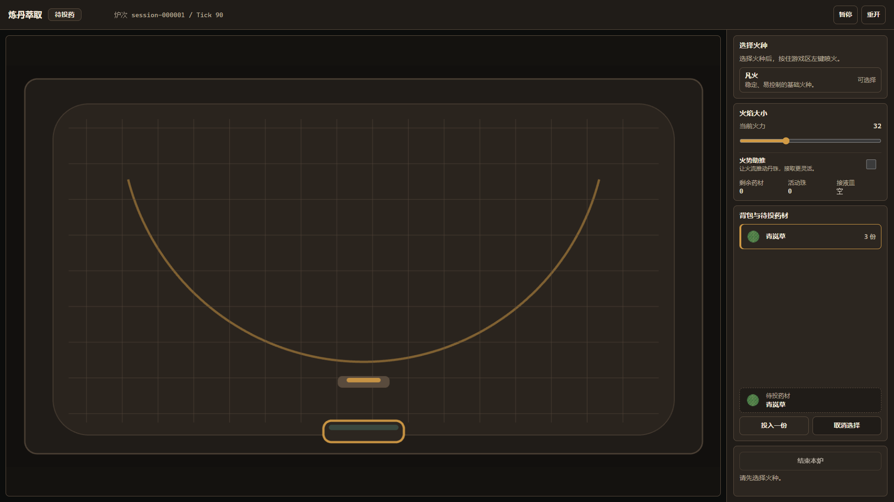
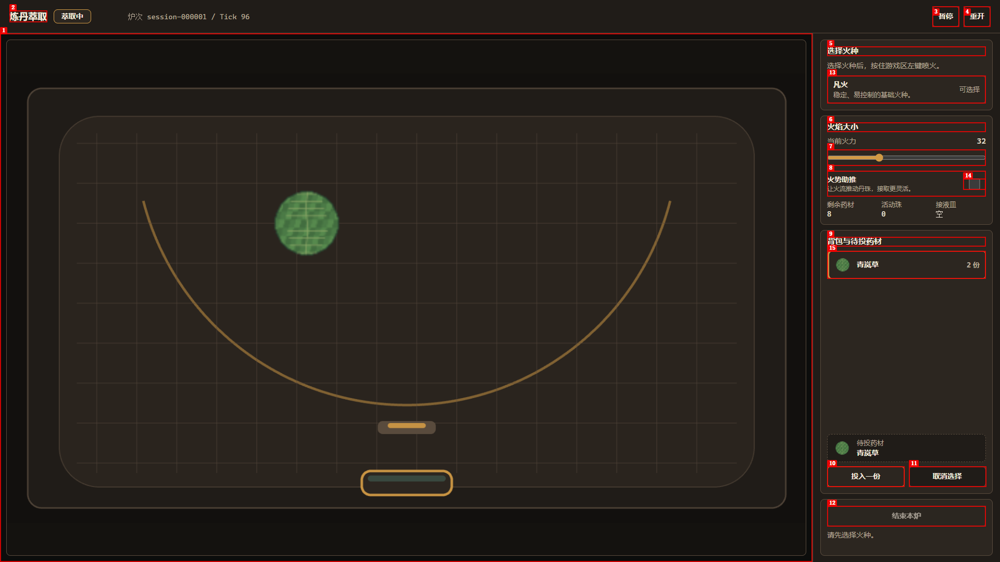

# M3 浏览器验收报告

| 项目 | 内容 |
| --- | --- |
| 日期 | 2026-07-15 |
| 地址 | http://127.0.0.1:4173 |
| 会话 | liandan-m3 |
| 范围 | M3 工作台、火势助推、三类丹珠、接取状态、警告与终态交互 |

## 摘要

| 严重度 | 数量 |
| --- | ---: |
| 严重 | 0 |
| 高 | 1 |
| 中 | 0 |
| 低 | 0 |
| 合计 | 1 |

本轮共发现 1 个高优先级问题，已修复 1 个，未解决 0 个。

## 功能验收

| 场景 | 结果 | 证据 |
| --- | --- | --- |
| 1920×1080 工作台与控制面板 | 通过 | [高火势与丹珠类型](screenshots/m3-high-fire-types.png) |
| 1366×768 工作台无裁切 | 通过 | [响应式布局](screenshots/ready-1366x768.png) |
| 药液、药渣、杂质三类丹珠生成 | 通过 | [三类丹珠与护盾](screenshots/m3-three-types-and-shields.png) |
| 火势助推开关与高火势推力 | 通过 | [助推开启](screenshots/issue-001-fixed-thrust-on.png) |
| 保护膜、受损、燃尽及损耗警告 | 通过 | [高损耗警告](screenshots/m3-loss-warning-high-fire.png) |
| 损耗超限失败并结算药渣 | 通过 | [失败终态](screenshots/m3-collector-caught.png) |
| “再来一炉”建立全新会话 | 通过 | [重开确认流程](screenshots/restart-confirmation.png) |
| 接取皿按类别入账 | 通过 | 浏览器快照记录杂质接取量 `0.5477698771816416` |

## 验收记录

### ISSUE-001：投药后自然损耗使模拟更新崩溃

| 项目 | 内容 |
| --- | --- |
| 严重度 | 高 |
| 分类 | 功能 / 控制台错误 |
| 状态 | 已修复并复验 |
| 地址 | http://127.0.0.1:4173 |
| 复现视频 | 未生成：本机 `agent-browser` 缺少 ffmpeg；已保留逐步截图与实际异常栈 |

**说明**

投入一份药材后，即使尚未点火，自然损耗也会开始结算；首轮损耗提交后，下一模拟 tick 在同步材料时抛出 `SIM_EXTRACTION_DOMAIN_MATERIAL_MISMATCH`。Phaser 更新停止，但 DOM 仍显示“萃取中”，后续火势助推等命令无法进入新 tick。

**复现步骤**

1. 打开工作台，保持初始待投药状态。
   

2. 选择青岚草。
   

3. 点击“投入一份”并等待自然损耗开始。界面停在 `Tick 98`、仍显示“萃取中”；浏览器捕获到两次相同异常：`Error: SIM_EXTRACTION_DOMAIN_MATERIAL_MISMATCH`，入口为 `ExtractionSimulation.#synchronizeMaterials`。
   

**根因与修复**

正式 64×64 三色组分图经单元格聚合后，与领域层按损耗依次扣减的结果存在约 `2.66e-13` 的浮点尾差。尾差在持续同步中累积，最终超过固定容差并触发材料端点不一致。

修复后，模拟增量携带材料体积的前后端点；提交层先校验前值、非递增约束与实际扣减量，再以操作次数缩放的舍入容差接受纯浮点尾差，并把领域材料余量规范化到模拟端点。实际不一致仍会被拒绝，提交保持原子性。

新增的生产配置回归测试在修复前复现了：模拟端点 `7.999967815171095`，领域计算值 `7.999967815170829`；修复后该用例与相关目标测试共 56 项通过。

**浏览器复验**

- 同一页面连续推进超过 2,500 个模拟 tick，材料余量持续变化，未再出现更新冻结。
- 修复前错误历史保留 2 条；复验全过程错误数量未增加。
- 高火势、火势助推、三类丹珠、保护膜、损耗失败、杂质接取与“再来一炉”均完成真实交互验证。
- 修复后运行截图：[持续模拟](screenshots/issue-001-fixed-live.png)、[助推开启](screenshots/issue-001-fixed-thrust-on.png)。

## 自动化回归

- `npm run check`：通过；40 个测试文件、437 项单元/集成测试全部通过，配置校验、素材校验与生产构建通过。
- `npm run test:e2e`：通过；Chrome 与 Edge 共 72 项端到端测试全部通过。
- 火种点击与火势助推时序用例额外在 Chrome/Edge 各重复 3 次，共 12 次全部通过。
- 生产构建保留现有的大包体积警告：主脚本约 1.69 MB（gzip 约 448 KB）。
